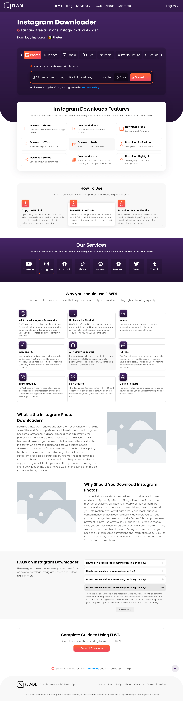

# FLWDL

The Ultimate Social Media Downloader

FLWDL is a modern web application that allows users to download multimedia content from a wide range of social media platforms effortlessly. Download videos, images, and other
media files without restrictions, all in one place. FLWDL offers a simple, efficient, and integrated solution for saving your favorite content from social networks.



---

## Features

- Download videos, images, and media from major social platforms (Instagram, TikTok, YouTube, Twitter, Facebook, Pinterest, Telegram, Tumblr, etc.)
- Fast, user-friendly interface
- Multi-language support (English, Persian)
- Responsive design (Next.js, CSS)
- No registration required
- Dark/light theme support
- Clipboard integration for easy pasting of links
- Platform-specific download tools and guides
- Dockerized for easy deployment

## Technology Stack

- **Frontend:** Next.js (React), CSS Modules
- **Backend:** Next.js API routes
- **Containerization:** Docker, Docker Compose
- **Other Libraries:**
    - RapidAPI (for some platform integrations)
    - i18next (internationalization)
    - Custom hooks and context for state management

## Requirements

- Docker & Docker Compose (recommended)
- Or, for manual setup:
    - Node.js 18+
    - pnpm (or npm/yarn)

## Quick Start (with Docker)

1. **Clone the repository:**
   ```bash
   git clone https://github.com/masoudkaarimi/flwdl.git
   cd flwdl
   ```
2. **Configure environment variables:**
    - Copy `.env.example` to `.env` and set your API keys/secrets.
3. **Build and run the containers:**
   ```bash
   docker compose up --build
   ```
4. **Access the app:**
    - Web: http://localhost:3000

## Manual Setup (without Docker)

1. Install dependencies:
   ```bash
   pnpm install
   # or
   npm install
   ```
2. Copy `.env.example` to `.env` and set your API keys/secrets.
3. Run the development server:
   ```bash
   pnpm dev
   # or
   npm run dev
   ```
4. Open [http://localhost:3000](http://localhost:3000) in your browser.

## Docker Compose Services

- **app:** Main Next.js application

## Screenshots

See the [`screenshots/`](screenshots/) directory for UI examples.

## License

This project is licensed under the MIT License.
